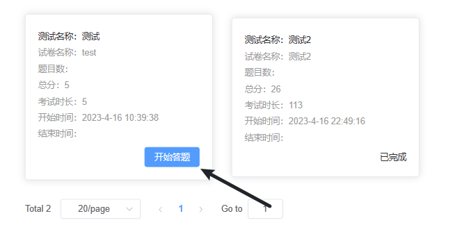

# 普通用户

## 登录

首先打开网站

点击右上角二维码切换至二维码登录

并使用钉钉扫码进行登录

如遇二维码未加载，因网络波动等原因，请耐心等待或稍后尝试刷新页面

---
## 导航栏

- `Home` 
- `All` 
- `考试中心` 
- `考试记录` 

---
### Home (首页)

首页默认显示俩个分类

- `入职必看`
- `岗位课程`

通过红框处可以选择更仔细的分类以及对已学和待学课程进行区分

---
### All (所有分类)

同主页类似
  

---
### 考试中心
在考试中心可以看到所有考试任务

---
### 考试记录
查看所有历史答卷记录

---
## 如何观看课程

点击任一课程进入学习模式  
例如  
  
在页面顶部显示了该课程学习进度 达到3/2即可完成本课程学习  
对于已观看过的部分可以拖拽进度条，未学习的部分无法快进  

---
## 如何查看数据
通过首页学习数据可以查看近30日学习时间以及总体学习进度

---
## 参加考试

点击导航栏考试中心  

选择对应测试参加考试

左侧分别显示了测试信息、题目列表、剩余试卷与提交按钮  
点击左侧题号可快速跳转至对应题目  
倒计时结束后会自动强制交卷  
完成测试后点击提交即可交卷  

---
### 查看历史记录

点击导航栏考试记录可查看所有考试历史记录  
  

---
详情：  

