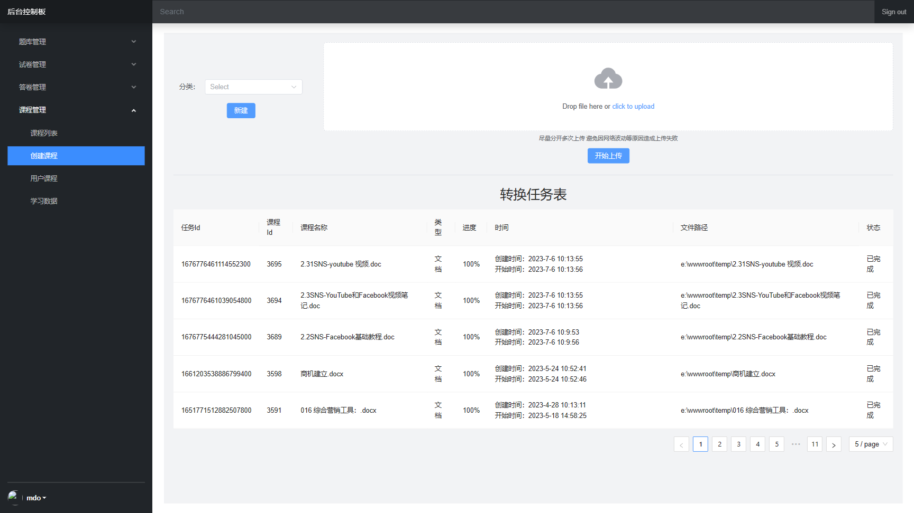

# 管理员
使用具有钉钉管理员权限的账号进行登录  
与普通用户功能不同的是顶部导航栏会多出一个管理后台选项  
点击进入后台  
  

---

## **课程管理**
### 创建课程
点击`课程管理`->`创建课程`  

点击左侧分类下拉框选择需要需要创建新课程的分类  
选择好分类后点击右侧文件选择器选择需要上传的文件并点击开始上传  

### 创建新的分类
同`创建课程`操作 进入页面后点击左侧下拉框下侧的新建按钮  
如果在新建时不选择上级目录则在当前根目录创建一个分类  
输入新分类名称后点击确认即可创建  

### 已有课程与分类管理
点击`课程管理`->`课程列表`  
即可查看并管理当前已上传的所有课程  
左侧为分类目录  
在左侧选择分类目录后即可查看所选择分类下的课程  

左侧目录选择器名称右侧有一个删除按钮
供删除分类使用  
使用分类删除前请确认要删除的分类  
此操作无法撤销  

### 用户课程管理
点击`课程管理`->`用户课程`  
左侧为组织架构选择器  
在左侧选择具体人员后并点击  
右侧显示了该用户需要进行学习的课程  
此处可对误分发的任务进行删除  

点击上方`添加课程`按钮  
右侧出现一个课程选择器  
勾选需要添加的课程后点击右下角确认即可完成添加  

---

## **题库管理**

### 题目列表  
在此可查看已创建的题目  
通过上方过滤器可以进行题目筛选  

### 创建题目
在创建题目时上方有一个分类标签  
可以不适用  
添加后可使用分类标签进行快速筛选  
#### 创建判断题

#### 创建单选题

#### 创建多选题

#### 创建填空题

#### 创建简答题

---

## **试卷管理**
### 创建试卷
点击`试卷管理`->`创建试卷`  
操作演示  

`填空题计分方法`
- 与答案不全匹配时，手动批改
需要人工进行批改  
- 与答案不全匹配时，机器自动批改
无需人工批改 但是存在错判情况  
- 与答案不全匹配时，自动0分
可能差一个空格都算0分

`多选计分方式`
- 多选、少选、错选不得分
- 少选时，按照选项个数计分
按比例得分  
- 少选时，得一半分数

`成绩公布设置`
- 不公布
- 成绩出来之后立即看到

### 发布测试
点击`试卷管理`->`试卷列表`  
操作演示  

`开始时间`  
指测试开始时间，未到开始时间无法进行作答

`截止时间`  
超过截止时间则无法参加测试  
可以不设置，长期有效

`部门列表`  
需要参加测试的部门  

`人员列表`
需要参加测试的人员  

尽量选了部门就不要选人员，选了人员就不要选部门  

### 已发布测试
点击`试卷管理`->`试卷列表`  
在此可以看到已发布的测试及完成情况  
鼠标悬浮至已交和未交数字上可显示具体名单  

### 批改及查看答卷
点击`答卷管理`->`完成列表`  
在此可查看已提交和需要人工介入批改的试卷  
通过上方的过滤器可查看不同用户提交的试卷  

